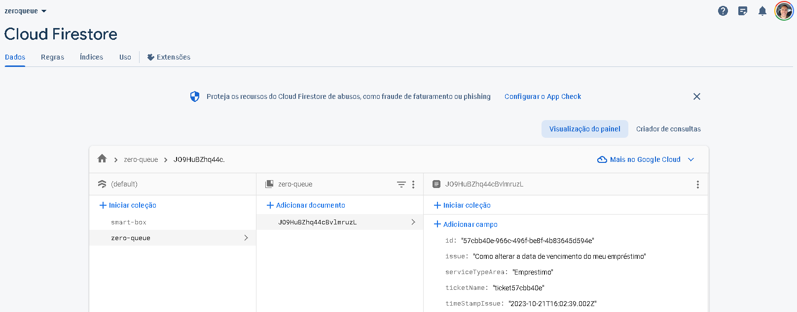
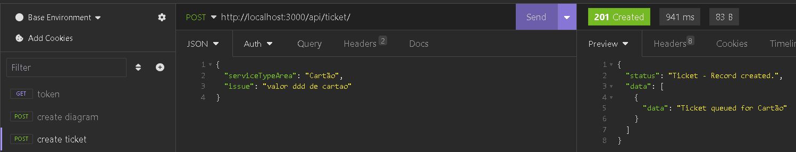
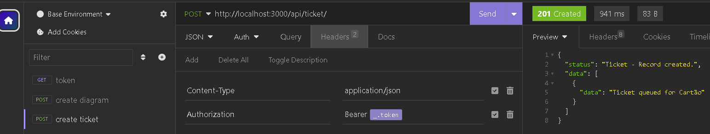
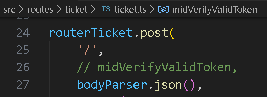
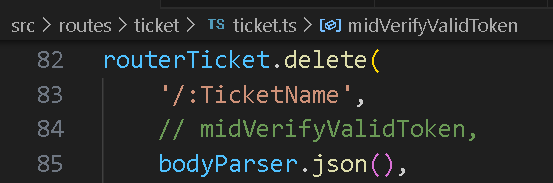
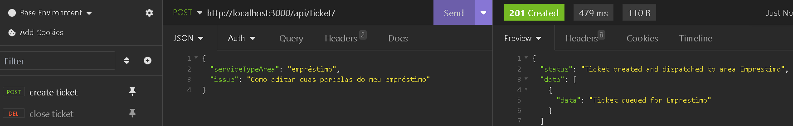
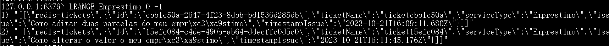
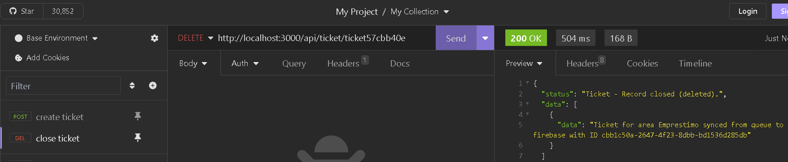
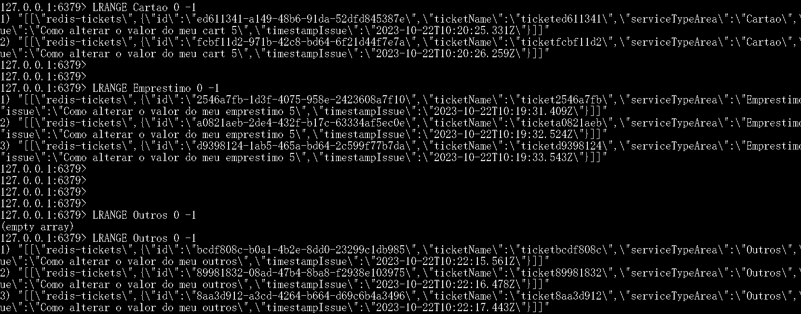
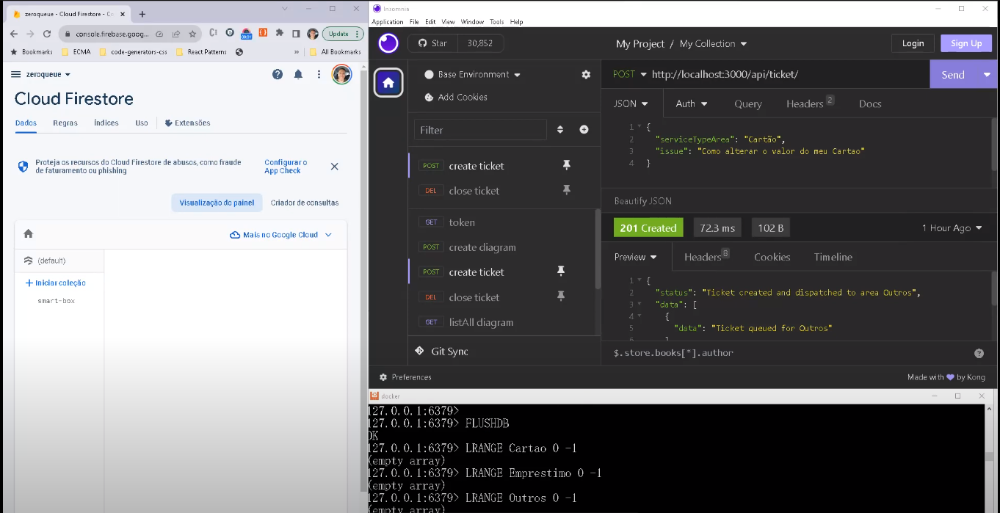

# Invext

## _CRUD developed in NodeJS with Express, Redis and Google Cloud (Firebase)_

author: Alexandre (alexandre.pisani.ant@gmail.com)

##### NPM 

-   npm i
-   npm run start

### Create .env and setup it with the vars below.
#### Setup a google cloud firebase with your own ID
```
NODE_ENV=dev
SERVER=localhost
EXPRESS_PORT=3000
REDIS_PORT=6379
COLLECTION_NAME=zero-queue

authDomain=zeroqueue-xxx.firebaseapp.com
apiKey=xxx
projectId=zeroqueue-xx
storageBucket=zeroqueue-xx.appspot.com
messagingSenderId=xx
appId=1:178763142648:web:xx
measurementId=G-xxx
```

## Firebase console
### Create your onw google cloud firebase at firebase console and change the information below by your own or concat the developer to send you the data for tests

##### src/config/google-firebase-keys-devs.ts
```
export const firebaseConfig: FirebaseOptions = {
    apiKey: process.env.apiKey,
    authDomain: process.env.authDomain,
    projectId: process.env.projectId,
    storageBucket: process.env.storageBucket,
    messagingSenderId: process.env.messagingSenderId,
    appId: process.env.appId,
    measurementId: process.env.measurementId
}
```
[Google firebase console](https://console.firebase.google.com/u/0/project/zeroqueue-30894/firestore)


## API Contract (Front-End team)

[Download Imsomnia](https://insomnia.rest/download)

Step-by-step to test the back-end APIs

-   Download the JSON files and import them into Insomnia
    [Download imsomnia json file](https://drive.google.com/file/d/145I5okDFDkm5TFr87sL5E2U6OBmofWov/view?usp=share_link)

-   Drag and drop the downloaded .json file onto the Insomnia UI. The import will be done automatically.

Run the first "token" API, which will return an access token to be used in other CRUD APIs. Authentication has been defined in the headers, but for demonstration purposes, they are hard-coded.
    

-   Now, insert the generated token into the next API in the Authentication header.



- The middleware token was deactivated in source code for didatic purposes only.Feel free to comment in the token at:




- After the creation of the third ticket to the same Attendance Area, the ticket is queued in REDIS


- See the ticket was queued in Redis


-   Now, Lets delete (close) some ticket in the firebase.The ticket was deleted in firebase and moved from queue to firebase


- Lets try to delete a ticket (Cartao area) in firebase but this theres no any queued ticket in redis.


- See!!!! the ticket was deleted in firebase only


### Pull Redis docker first of all.
> docker pull redis
#### Run the container and exposes it to port 6379
> docker run -d --name my-redis-container -p 6379:6379 redis
#### Start nodejs on localhost and fetch APIs as described in the topis below
#### Access container:
> docker exec -it my-redis-container sh
 - Inside the container run : redis-cli and


-   Implementation with Jest and Supertest (mock)
    

## Finally :) Lets create some tickets and see what happens
### The first 3 tickets goes to firebase. It means the attendant has only 3 tickets to resolve.
 - After the third ticket create, it goes to redis queue.
 - As soon as the attendant resolves (close) one ticket, the queue transfers ticket to firebase again.
 - [](https://youtu.be/qOU5n9jsi_A)
 
## Finally2 :) Lets create some tickets and clean up queue
- [](https://youtu.be/LkAfhdv_nj4)
