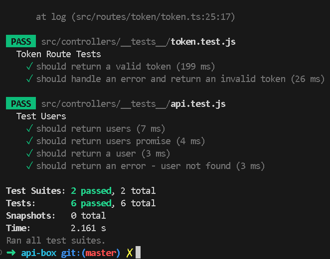

# PlayBOX

## _CRUD developed in NodeJS with Express and Google Cloud (Firebase)_

author: Alexandre (alexandre.pisani.ant@gmail.com)

##### NPM 

-   npm i
-   npm run start

## Firebase console
### Create your onw google cloud firebase at firebase console and change the information below by your own or concat the developer to send you the data for tests

##### src/config/google-firebase-keys-devs.ts
```
export const firebaseConfig: FirebaseOptions = {
    apiKey: process.env.apiKey,
    authDomain: process.env.authDomain,
    projectId: process.env.projectId,
    storageBucket: process.env.storageBucket,
    messagingSenderId: process.env.messagingSenderId,
    appId: process.env.appId,
    measurementId: process.env.measurementId
}
```
[Google firebase console](https://console.firebase.google.com/u/0/project/zeroqueue-30894/firestore)


## API Contract (Front-End team)

[Download Imsomnia](https://insomnia.rest/download)

Step-by-step to test the back-end APIs

-   Download the JSON files and import them into Insomnia
    [Download imsomnia json file](https://drive.google.com/file/d/18KULzRj5Gn2sARYLoD_wylefSzxgTwwb/view?usp=sharing)

-   Drag and drop the downloaded .json file onto the Insomnia UI. The import will be done automatically.

Run the first "token" API, which will return an access token to be used in other CRUD APIs. Authentication has been defined in the headers, but for demonstration purposes, they are hard-coded.
    

-   Now, insert the generated token into the next API in the Authentication header.
    
    

-   Send the POST request and check in the Firebase console and the list API.
    


-   Implementation with Jest and Supertest (mock)
    
